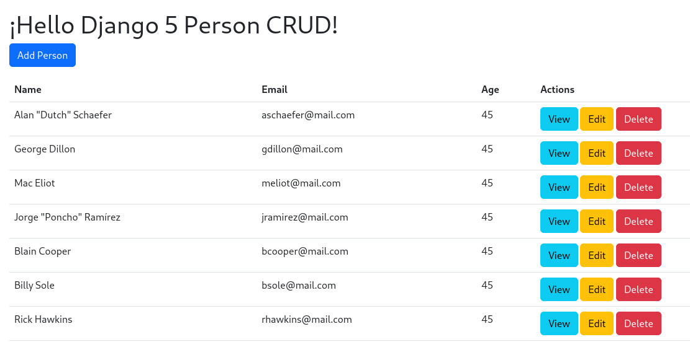

# Django 5 CRUD Example

The following is an example of CRUD (Create, Read, Update, Delete) in Django 5.

## Requirements:
```
Django==5.2.4
Python>=3.11
```

## Run the following commands in sequence to deploy the project to a development environment:

```bash
$ pip install -r requirements.txt

$ cp repositorio_certificados/settings.py_example repositorio_certificados/settings.py

$ python manage.py makemigrations

$ python manage.py migrate

$ python manage.py createsuperuser

$ python manage.py runserver
```

## Test the project:

Open your browser to http://127.0.0.1:8000 and you'll see the Django welcome
page 🚀.

## Image


